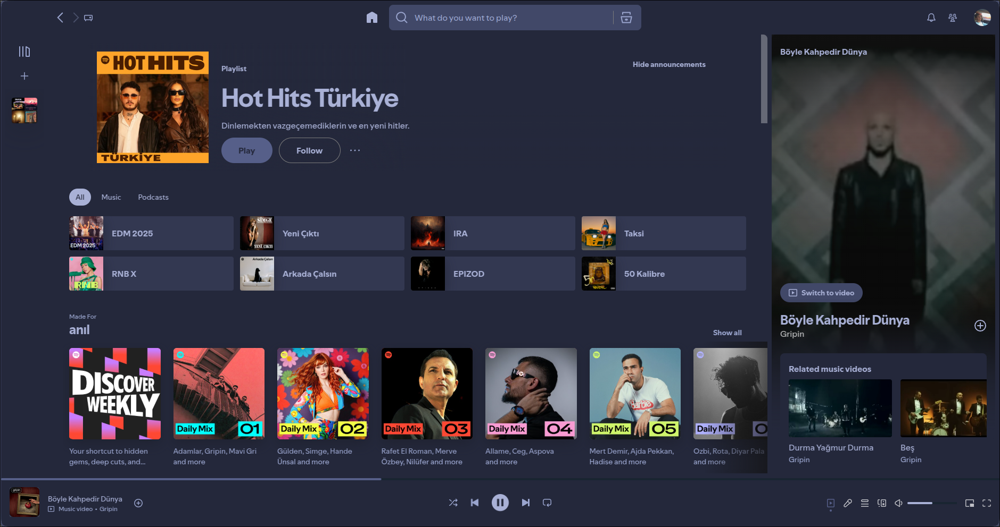
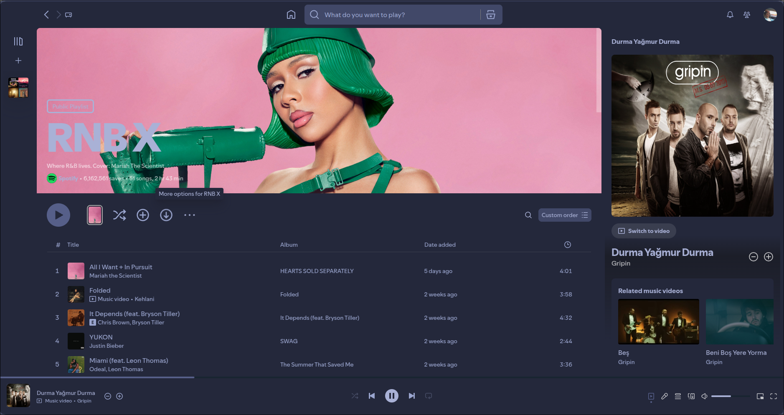

# TokyoNight - Spicetify Theme

Custom Spotify Theme for Spicetify








## 📂 Theme Files

- `color.ini` → Theme color settings
- `user.css` → Custom CSS for UI modifications
- `main.png` → Screenshot of the theme (optional)
- `playlist.png`

---

## ⚡ Installation

1. **Copy the theme folder to Spicetify themes directory:**
```bash
cp -r TokyoNight ~/.config/spicetify/Themes/

spicetify config current_theme TokyoNight

spicetify apply
